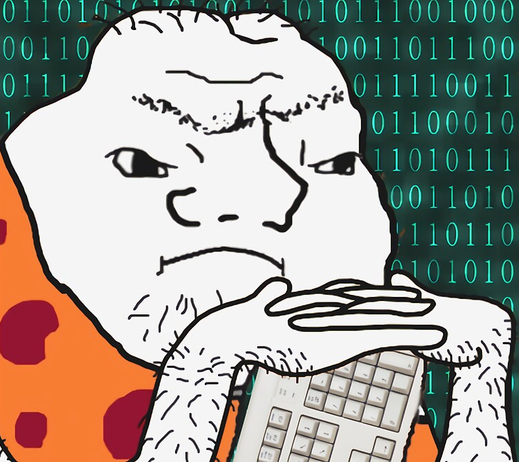

> Переклад статті від розробника з 30-річним досвідом, 
> маґістра Стенфордського університету і автора HTMX - Carson Gross
> https://grugbrain.dev/

# Розробник з мозком Ґруґа (The Grug Brained Developer)
Посібник для чайників про те, як мислити, як самосвідомий простак 
(A layman's guide to thinking like the self-aware smol brained)

## Вступ

це збірка думок про розробку програмного забезпечення, зібрана розробником з ґруґ-мозок.

ґруґ-мозок не розумний, але програмає вже багато років і дещо навчився, хоча плутається.

ґруґ-мозок намагається зібрати свої знанинки у маленьку, легку та смішну сторінку, не тільки для вас, молодих ґруґів, але і для себе, тому що з віком він забуває важливі речі, наприклад, що їв на сніданок або чи надів штани.

розумний-мозок розробників багато, і деякі з них не подобається читати це, робити кисле обличчя.

*ДУМАЮТЬ*, що вони розумний-мозок розробники ще більше, багато більше, і ще більше, напевно, можливо, їм точно не сподобається читати це, багато кислих облич (такий інтернет).

(примітка: ґруґ колись думав, що він розумний, але навчився важким шляхом).

це нормуль!

це вільна країна, до певної міри, і в кінці кінців все це не має великого значення, але ґруґ сподівається, що вам буде весело читати і, можливо, ви навчитеся з багатьох, багатьох помилок, які ґруґ зробив за довге програмістське життя.

## Вічний ворог: Складність (The Eternal Enemy: Complexity)

головний хижак ґруґа - це складність

складність - погано

повторюю:

складність - *дуже* погано

всі разом зараз:

складність - *дуже-дуже* погано

якби був вибір між складністю та боєм раз на раз з тиранозавром, ґруґ обрає тиранозавра: принаймні ґруґ бачить тиранозавра

складність - це дух демон, він входить в кодові бази через добрих в сердці, але в кінцевому результаті таких, яких дуже хочеться вдарити дубиною, розробників без ґруґ-мозку та менеджерів проєктів, які не бояться духа демона складності або навіть не знають про нього

одного дня кодова база зрозуміла, і ґруґ може працювати, все добре!

наступного дня - неможливо: дух демона складності увійшов у код і дуже небезпечна ситуація!

ґруґ не може бачити духа демона складності, але ґруґ відчуває його присутність у кодовій базі

дух демона складності насміхається над ним, змінює тут, ламає щось інше!?! mock mock mock(насмішка) ха-ха так весело, ґруґ любить програмування і не стає шукачем блискучих каменів, як радив старший ґруґ

дубина не працює на демона духа складності, а бити розробника який впустив духа, погана ідея, іноді це сам ґруґ!

на жаль, часто це сам ґруґ

тож ґруґ повторює знову і знову: складність *дуже*, *дуже* погано

### Казати "Ні"

найкраща зброя проти духа демона складності - це чарівне слово: "ні"

"ні, ґруґ не буде будувати цю функцію"

"ні, ґруґ не буде створювати цю абстракцію"

"ні, ґруґ не буде лити воду на тіло щодня або пити менше чорного соку для думання, припиніть запитувати це знову"

зауважте, це добра інженерна порада, але погана кар'єрна порада: "так" - чарівне слово для отримання більше блискучих каменів і керування великою плем'ю розробників

сумно, але правда: навчіться казати "так", а потім навчіться звинувачувати інших ґруґів, коли щось не виходить, ідеальна кар'єрна порада

але ґруґ має бути вірним собі, і "ні" - це чарівне слово ґруґа. Спочатку важко сказати, особливо якщо ти добрий ґруґ і не любиш розчаровувати людей (багато таких ґруґів!), але з часом легше, навіть якщо купа блискучих каменів не така висока, як могла б бути

це нормально: скільки блискучих каменів ґруґу насправді потрібно?

### Казати "Ок"

іноді компроміс необхідний, інакше не буде блискучих каменів, а це означає, що не буде м'яса динозавра, що не добре, дружина суворо нагадує ґруґу про молодих ґруґів вдома, які потребують даху, їжі тощо, не цікавиться ґруґовими балачками про демона складності в п'ятдесятий раз

у такій ситуації ґруґ рекомендує "ок"

"ок, ґруґ побудує цю функцію"

потім ґруґ витрачає час на обдумування рішення 80/20 і будує це замість іншого.
рішення 80/20 каже "80% бажаного з 20% коду", можливо, воно не має всіх прикрас, які хоче менеджер проєкту, може бути трохи некрасивим, але працює і надає більшість цінності, і тримає демона складності осторонь, частково.

іноді, можливо, найкраще просто не казати менеджеру проєкту і робити це по-своєму 80/20. легше просити вибачення, ніж дозволу, менеджери проєктів, як метелики, часто перевантажені і мають справу з багатьма ґруґами. часто забувають, що взагалі повинна робити ця функція, або рухаються далі, або звільняються, або їх звільняють, ґруґ бачив багато таких випадків

в будь-якому випадку, це в інтересах менеджера проєкту, тому ґруґу не слід надто сильно перейматися цим підходом

### Факторинг вашого коду

наступна стратегія дуже складніша: правильно розділити кодову базу (модне слово: "факторинг коду"). Тут важко дати загальні поради, бо кожна система дуже різна. Проте одна річ, у яку ґруґ вірить: не факторуйте свій додаток занадто рано!

на початку проєкту все дуже абстрактне і схоже на воду: дуже мало твердих основ для мозку ґруґа. Потрібен час, щоб розвинути "форму" системи і зрозуміти, що взагалі робиться. Ґруґ намагається не факторувати на початковому етапі проєкту, і в певний момент з коду з'являються хороші точки розділу

хороша точка розділу має вузький інтерфейс з рештою системи: невелика кількість функцій або абстракцій, які приховують демона складності всередині, як у кристалі

ґруґ дуже задоволений, коли демон складності правильно заточений у кристалі, це найкраще відчуття — заточити смертельного ворога!

ґруґ намагається терпляче спостерігати, як з коду з'являються точки розділу і повільно рефакторує, з часом кодова база приймає форму, накопичується досвід. немає чітких/швидких правил для цього: ґруґ знає точку розділу, коли її бачить, просто потрібен час, щоб розвинути вміння бачити, терплячість

іноді ґруґ починає занадто рано і неправильно створює абстракції, тому ґруґ схиляється до очікування.

великий-мозок розробникам це часто зовсім не подобається, і вони винаходять багато абстракцій на початку проєкту

ґруґу хочеться дотягнутися до дубини і кричати "великий мозок не пиши код! великий мозок переходь до наступного комітету з архітектури, залиш код для ґруґа!"

але ґруґ вчиться контролювати свої пристрасті, це головна різниця між ґруґом і твариною

натомість ґруґ намагається обмежити шкоду від великий-мозок розробника на початку проєкту, даючи їм такі речі, як UML-діаграми (не шкодить коду, ймовірно, їх все одно викинуть) або вимагаючи робочий демо-зразок на завтра

робочий демо-зразок — особливо гарний трюк: змушує великий мозок створити щось, що насправді працює, про що можна говорити і код, який допоможе великому мозку швидше побачити реальність на місцях

пам'ятайте! великий мозок має великий мозок! його потрібно лише спрямувати на добро, а не випадково в служіння демону складності, часто бачив таке

(найкращий ґруґ-мозок здатний направити кілька великих мозків у правильному напрямку і створити багато кристалів для заточення демонів складності, велика купа блискучих каменів чекає на такого ґруґа!)

також іноді називають підхід з демо-зразком "прототипування", звучить більш витончено для менеджера проєкту

ґруґ каже, прототипуй на ранніх етапах розробки програмного забезпечення, *особливо* якщо є багато великих мозків

## Tестування

ґруґ любить і ненавидить тестування: тести врятували ґруґа багато, багато незліченних разів, і ґруґ любить і поважає тести.

на жаль, також існує багато шаманів тестування. деякі шамани тестування роблять тест ідолом, вимагають речі на кшталт "спочатку тест", перш ніж ґруґ навіть напише код або зрозуміє, що ґруґ робить у цій галузі!

як ґруґ може тестувати те, чого ще не розуміє в домені!?

"О, не хвилюйся: тести покажуть тобі, що потрібно робити."

ґруґ знову повільно тягнеться до дубини, але залишається спокійним

ґруґ замість цього воліє писати більшість тестів після фази прототипування, коли код починає набувати форми

але, зверніть увагу: тут ґруґ повинен бути дуже дисциплінованим!

легко ґруґу перейти далі і не писати тести, бо "працює на машині ґруґа"!

це дуже, дуже погано: немає гарантії, що працюватиме на іншій машині і немає гарантії, що працюватиме на машині ґруґа в майбутньому, багато разів перевірено

шамани тестування мають слушну думку щодо важливості тестування, навіть якщо шамани тестування часто не завершують корисну функцію в житті і говорять лише про тестування весь час, заслуговують на дубину, але серце у них в правильному місці

також, шамани тестування часто дуже багато говорять про юніт-тести, але ґруґ не знаходить їх настільки корисними. ґруґ досвід показує, що ідеальні тести — це не юніт-тести або end-to-end тести, а щось середнє між ними

ґруґ пише юніт-тести переважно на початку проєкту, допомагає розпочати, але не дуже прив'язується і не очікує великої цінності на довгий час.

end-to-end тести хороші, показують роботу всієї системи, але! важко зрозуміти, коли вони ламаються і часто зводять ґруґа з розуму, іноді ґруґи просто ігнорують їх, бо "о, вони ламаються постійно" - дуже погано!

тести посередині, ґруґ чув, шамани іноді називають "інтеграційні тести" з кислим виразом обличчя. але ґруґ каже, що інтеграційні тести - це ідеальне місце: досить високого рівня, щоб тестувати коректність системи, і досить низького рівня, щоб з хорошим налагоджувачем легко було бачити, що ламається

ґруґ воліє деякі юніт-тести, особливо на початку, але не 100% покриття всього коду тестами і точно не "спочатку тест". "тестування по ходу" працює досить добре для ґруґа, особливо коли ґруґ розбирається з речами

ґруґ фокусується на інтеграційних тестах з моменту, коли з'являються точки розділу і система стабілізується! api точки розділу, сподіваємось, стабільніші порівняно з реалізацією, і інтеграційні тести залишаються цінними на довгий час, і легко налагоджувати

також створюється невеликий, добре обраний набір end-to-end тестів, який підтримується в робочому стані під загрозою дубини. фокус важливих end-to-end тестів на найпоширеніших функціях ui та кількох найважливіших крайніх випадках, але не надто багато, інакше стане неможливо підтримувати, і їх почнуть ігнорувати

це ідеальний набір тестів для ґруґа.

можливо, вам не сподобається, але це вершина ґруґ-тестування.

також, ґруґ не любить мокати в тестах, воліє тільки коли абсолютно необхідно (рідко/ніколи) і тільки грубе мокання (точки розділу/системи).

один виняток "спочатку тест", який не любить ґруґ: коли знайдено помилку. ґруґ завжди намагається спочатку відтворити помилку за допомогою регресійного тесту, а потім виправити помилку, цей випадок чомусь працює краще

## Agile

ґруґ думає, що agile не жахливий, не хороший.

в кінці дня, це не найгірший спосіб організувати розробку, можливо, краще за інші, ґруґ припускає, що нормально.

небезпека, однак, у шаманах agile! багато, багато блискучих каменів втрачається через шаманів agile!

коли agile проєкт зазнає невдачі, шаман agile каже "ви неправильно використовували agile!" ґруґ відзначає, що це дуже зручно для шамана agile, просить більше блискучих каменів для кращого навчання молодих ґруґів agile, небезпека!

ґруґ спокушається дотягнутися до дубини, коли занадто багато розмов про agile, але завжди залишається спокійним.

прототипування, інструменти та наймання хороших ґруґів є кращими ключами до успіху в програмному забезпеченні: процес agile ок і трохи допомагає, але іноді шкодить, коли його сприймають занадто серйозно.

ґруґ каже, що жодна срібна дубина не виправить усі проблеми програмного забезпечення, незалежно від того, що каже шаман agile (небезпека!).

## Рефакторинг

рефакторинг - хороша діяльність і часто гарна ідея, особливо пізніше в проєкті, коли код уже стабілізувався.

проте, ґруґ помічає, що багато разів у кар'єрі "рефакторинги" йшли жахливо невдало і завдавали більше шкоди, ніж користі.

ґруґ не зовсім впевнений, чому деякі рефакторинги працюють добре, а деякі зазнають невдачі, але ґруґ помічає, що чим більший рефакторинг, тим більше ймовірності, що станеться невдача.

тому ґруґ намагається тримати рефакторинги відносно невеликими і не віддалятися "занадто далеко від берега" під час рефакторингу. ідеально, щоб система працювала весь час, і кожен крок був завершений перед початком наступного.

end-to-end тести тут - справжні рятівники, але часто дуже важко зрозуміти, чому вони ламаються... такий вже він, рефакторинг.

також ґруґ помічає, що введення занадто великої кількості абстракцій часто призводить до невдачі рефакторингу і невдачі системи. хороший приклад - введення [J2EE](https://www.webopedia.com/definitions/j2ee/), багато великих мозків сиділи, обдумували занадто багато абстракцій, нічого хорошого з цього не вийшло, багато проєктів постраждало

ще один хороший приклад - коли компанія, де працював ґруґ, впровадила [OSGi](https://www.techtarget.com/searchnetworking/definition/OSGi), щоб допомогти керувати/заточити духа складності в кодовій базі. не тільки OSGi не допоміг, але й зробив демона складності набагато потужнішим! знадобилося кілька років найкращих розробників, щоб переробити все це! більше складного духа і тепер неможливо реалізувати нові функції! дуже погано!

## Огорожа Честертона

мудрий шаман ґруґів, [Честертон](https://en.wikipedia.org/wiki/G._K._Chesterton), одного разу сказав:

 > є певна інституція або закон; скажімо, для простоти, паркан або ворота, зведені через дорогу. більш сучасний тип реформатора підходить до нього весело і каже: «я не бачу сенсу в цьому; давайте приберемо його.» на що більш розумний тип реформатора добре відповість: «якщо ти не бачиш у цьому сенсу, я, звісно, ​​не дозволю тобі прибрати це. йди подумай. тоді, коли ти зможеш повернутися і сказати мені, що бачиш у цьому сенс, я, можливо, дозволю тобі його зруйнувати.»

багато старших ґруґів добре засвоїли цей урок, не починають виривати код бездумно, незалежно від того, наскільки він потворний

ґруґ розуміє, що всі програмісти-платоністи на якомусь рівні бажають досконалості коду, подібної до музики сфер. але тут є небезпека, світ часто потворний і незграбний, і тому код також повинен бути таким

скромність не часто властива великим мозкам або тим, хто вважає себе великими мозками, або навіть самому ґруґу, але ґруґ часто знаходить, що "о, ґруґ не подобається вигляд цього, ґруґ виправить" приводить до багатьох годин болю для ґруґа і не кращої або навіть гіршої системи

ґруґ на початку кар'єри часто вривався в кодову базу, розмахуючи дубиною і все трощив, вчився, що це не добре

ґруґ не каже, що ніколи не потрібно покращувати систему, це було б зовсім дурно, але рекомендує спочатку витратити час на розуміння системи, особливо якщо вона велика, і поважати код, який працює сьогодні, навіть якщо він не ідеальний

тут тести часто є хорошою підказкою, чому паркан не варто руйнувати!
